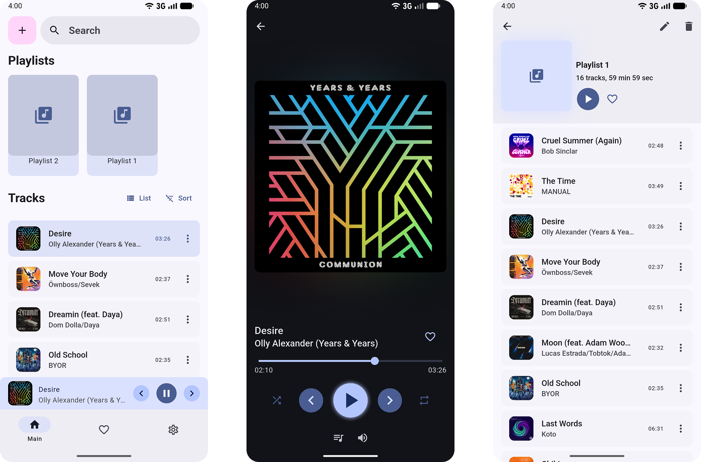

    

<h1> Mate Player </h1>

A simple local audio player in the Material 3 Design style.  
Available on platforms: Linux, Windows, Android.

    

<h2>Direct Download</h2>

## Shortkeys

* `Alt` + `M`: Mute/Unmute

* `Alt` + `R` : Change Repeat Mode

* `Alt` + `S`: Shuffle

* `Ctrl` + `➡`: Next Track

* `Ctrl` + `⬅`: Previous Track

* `F11`: Fullscreen

## Supported Languages

* 🇷🇺 - Русский
* 🇺🇸 - English

## Screenshot

## Dynamic color

## Light/Dark theme

## Mobile screenshots

